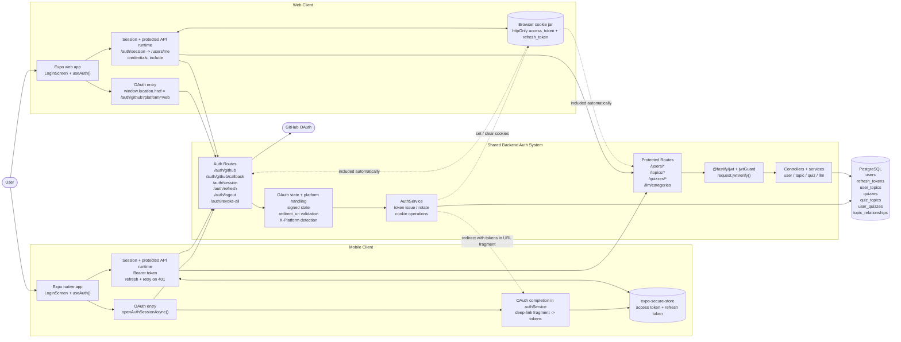
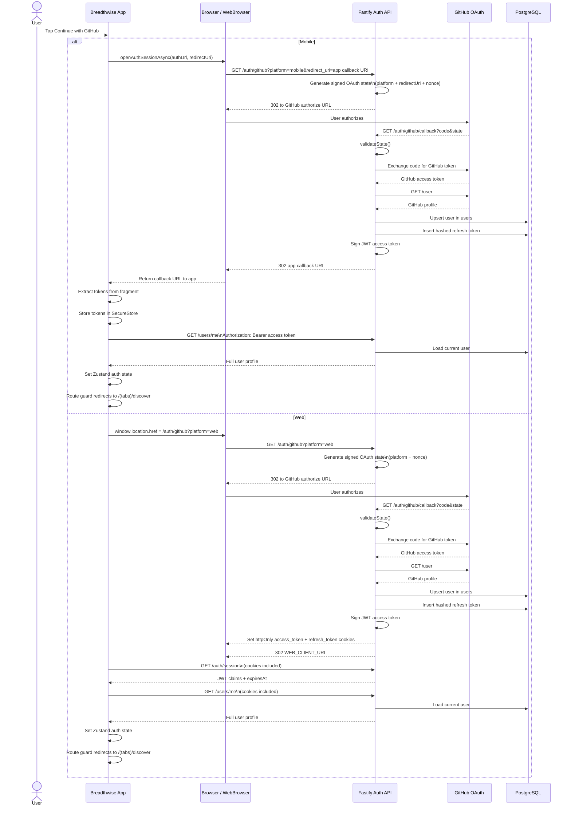
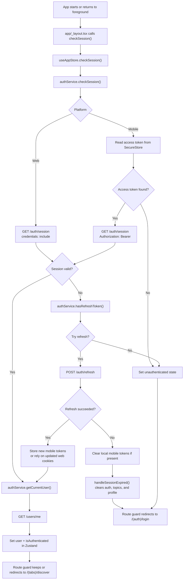
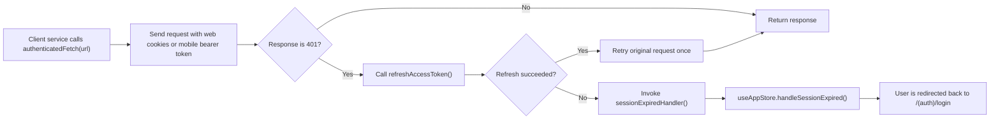

# Breadthwise Authentication and Authorization Design

## Scope

This document describes the current authentication and authorization implementation for the Breadthwise Expo app and Fastify backend.

It reflects the running code paths in the mobile app, web app, and backend only.

## System Summary

Breadthwise uses GitHub OAuth as its only identity provider.

The backend owns the security-critical parts of the flow:

- OAuth state generation and validation
- GitHub code exchange and profile retrieval
- User upsert
- JWT access-token issuance
- Refresh-token creation, hashing, rotation, and revocation
- Cookie management for web
- Session validation via JWT verification

The Expo client owns the user-facing and platform-specific session behavior:

- Login UX
- Mobile deep-link OAuth completion through `expo-web-browser`
- Mobile token persistence in `expo-secure-store`
- Auth state in Zustand
- App boot and foreground session checks
- Route guarding in `app/_layout.tsx`
- Automatic refresh-and-retry in `authenticatedFetch()` and the streaming service wrappers

Authorization is intentionally thin today. The system primarily enforces authenticated access, then scopes many user, topic, and quiz operations with `request.user.sub`. Some authenticated endpoints serve shared application data rather than user-owned resources. There is no role model, admin model, or RBAC layer in the current implementation.

## Actors And Runtime Components

- User
- Breadthwise Expo app and web client
- GitHub OAuth
- Fastify API
- PostgreSQL tables: `users`, `refresh_tokens`, `user_topics`, `quizzes`, `quiz_topics`, `user_quizzes`, `topic_relationships`

The diagram below is a cross-platform auth architecture view. It keeps the shared backend core in one place and only splits the flow where web and mobile behavior materially differs.

## Token Model

| Asset              | Created By                                    | Where It Lives                                                    | How It Is Used                                                                     | Lifetime                   |
| ------------------ | --------------------------------------------- | ----------------------------------------------------------------- | ---------------------------------------------------------------------------------- | -------------------------- |
| Access token       | Backend `AuthService.generateTokens()`        | Web: httpOnly `access_token` cookie. Mobile: `expo-secure-store`  | Web requests rely on cookies. Mobile requests send `Authorization: Bearer <token>` | `15m`                      |
| Refresh token      | Backend `AuthService.generateTokens()`        | Web: httpOnly `refresh_token` cookie. Mobile: `expo-secure-store` | Used only for `/auth/refresh` and optionally `/auth/logout`                        | Web: `7d`, Mobile: `30d`   |
| Refresh-token hash | Backend `AuthRepository.createRefreshToken()` | `refresh_tokens` table                                            | Server-side lookup, rotation, revocation                                           | Until expiry or revocation |
| OAuth state        | `auth.routes.ts` + `oauth-state.ts`           | Browser redirect state parameter                                  | Protects the OAuth redirect flow and carries platform context                      | `10m`                      |

### Access Token Payload

The JWT payload contains the authenticated principal and request context used by the backend:

- `sub`: Breadthwise user id
- `githubId`
- `username`
- `email` when available
- `platform` (`web` or `mobile`)
- `iat`, `exp`
- `fingerprint` only when fingerprinting is enabled in backend env

The current implementation generates the optional fingerprint claim but does not use it as an authorization gate.

### Refresh Token Behavior

- Refresh tokens are random opaque values, not JWTs.
- The backend stores only a SHA-256 hash of the refresh token.
- Every successful refresh revokes the previous token and issues a new access-token and refresh-token pair.
- `POST /auth/revoke-all` exists on the backend, but the Expo client currently uses the normal logout flow instead.

### OAuth State Behavior

- The state payload contains `nonce`, `platform`, optional `redirectUri`, `iat`, and `exp`.
- The backend signs it with HMAC-SHA256.
- Validation uses timing-safe signature comparison.
- The backend allows a `60` second future-skew tolerance when validating `iat`.
- Mobile OAuth requires a redirect URI that starts with the configured deep-link scheme.

## Platform Split

| Concern                       | Web                                                         | Mobile                                                                                       |
| ----------------------------- | ----------------------------------------------------------- | -------------------------------------------------------------------------------------------- |
| OAuth entry                   | `window.location.href = /auth/github?platform=web`          | `openAuthSessionAsync()` with `/auth/github?platform=mobile&redirect_uri=<app callback URI>` |
| OAuth completion              | Backend sets cookies and redirects back to `WEB_CLIENT_URL` | Backend redirects to `<app callback URI>#access_token=...&refresh_token=...`                 |
| Token persistence             | Browser cookie jar                                          | `expo-secure-store`                                                                          |
| Normal authenticated requests | Cookies + `credentials: include`                            | `Authorization: Bearer <access token>`                                                       |
| Session probe                 | `GET /auth/session` with cookies                            | `GET /auth/session` with bearer token                                                        |
| Refresh                       | `POST /auth/refresh` reads cookie                           | `POST /auth/refresh` sends refresh token in JSON body                                        |
| Logout                        | Backend clears cookies                                      | Client clears SecureStore even if network logout fails                                       |

On mobile, the callback URI is generated at runtime with `Linking.createURL('auth/callback')`. The backend validates only that it starts with the configured deep-link scheme, which defaults to `breadthwise://`.

## OAuth Login Sequence

## Session Bootstrap And Protected Request Flow

The frontend resolves session state in two places:

- On app boot, `app/_layout.tsx` calls `checkSession()`.
- On app foreground resume, `app/_layout.tsx` calls `checkSession(true)`.

The store does not trust `/auth/session` as a complete user record. It uses `/auth/session` only as a lightweight validity probe, then fetches `/users/me` to populate the full profile in state.

`authenticatedFetch()` handles token expiry during normal API usage.

Topic and quiz streaming requests do not go through `authenticatedFetch()`. Their client services implement the same high-level pattern manually: if the initial SSE request returns `401`, they call `refreshAccessToken()` once and retry the stream.

## Current Authorization Model

### What The Backend Enforces

- `@fastify/jwt` plus `jwtGuard` enforce authentication by calling `request.jwtVerify()`.
- `GET /auth/session` and `POST /auth/revoke-all` require a valid authenticated request.
- All `/users/*` routes are behind `fastify.authenticate`.
- All `/topics/*` routes are behind `fastify.authenticate`.
- All `/quizzes/*` routes are behind `fastify.authenticate`.
- `GET /llm/categories` is behind `fastify.authenticate`.

### What Is User-Scoped Today

- `/users/me`, `/users/me/stats`, and `/users/me` updates operate on `request.user.sub` only.
- Topic list, topic detail, topic status updates, topic deletion, topic facets, and topic events pass `request.user.sub` into the topic service.
- `POST /quizzes` requires the requested topic to exist and to already belong to the current user before generating or reusing a quiz.
- Repository queries for many topic operations constrain reads and writes through `user_topics.user_id`.
- Topic relationships returned by insights and hyperlink queries annotate whether the target topic is already owned by the current user.

### What Is Not Implemented

- No `role`, `permission`, or admin columns exist on the `users` table.
- No RBAC or policy middleware exists in the backend.
- No frontend role-aware routing or feature gating exists.

### Important Current Boundaries

Some authenticated endpoints are not fully ownership-checked.

- `GET /topics/:id/insights` verifies the topic exists and uses `userId` only to annotate which returned targets are already owned.
- `POST /topics/:id/insights` verifies only that the topic exists before starting insight generation.
- `POST /topics/:id/hyperlinks` verifies only that the topic exists before starting hyperlink extraction.
- `POST /quizzes/:id/attempts` verifies that the quiz exists and resolves its linked topic, but it does not currently verify that the current user owns that topic or that the quiz was previously issued to that user before inserting into `user_quizzes`.

In other words, the system currently distinguishes between authentication, user-scoped resources, and shared authenticated resources, but it does not attempt to model fine-grained permissions or ownership checks on every endpoint.

The intended hardening for `POST /quizzes/:id/attempts` is stricter than the current implementation: it should require both topic ownership and proof that the quiz was issued to the current user before writing `user_quizzes`. That guarantee is not implemented today.

## Design Notes

### 1. The Backend Owns Authentication State Transitions

The backend is the single authority for:

- whether an OAuth callback is valid
- whether a refresh token is still active
- when refresh rotation happens
- whether a JWT is currently valid

The client never manufactures identity state locally. It only stores or forwards tokens that the backend created.

### 2. Mobile OAuth Completion Is In-App, Not Route-Driven

Mobile login does not rely on a dedicated Expo callback screen to parse tokens. The app receives the final callback URL directly from `WebBrowser.openAuthSessionAsync()`, extracts the URL fragment in `authService`, stores tokens, then fetches `/users/me`.

### 3. Web Session Recovery Is Redirect-Then-Probe

Web login depends on a full browser redirect to the backend and back again. After redirect completion, the client rebuilds auth state by probing `/auth/session` and then calling `/users/me`.

### 4. `/auth/session` Is Not A User Profile Endpoint

The session endpoint returns JWT claims and expiry only. The client must call `/users/me` for display fields like `displayName`, `avatarUrl`, and timestamps.

### 5. Logout Prefers Local Safety

On mobile, logout clears local SecureStore tokens even if the network request to `/auth/logout` fails. That prevents a broken network call from leaving stale credentials on the device.

### 6. Fingerprinting Is Present But Not An Authz Layer

The backend can attach a request fingerprint to the JWT payload when enabled, but the current system does not reject requests based on fingerprint mismatches. It is metadata in the current implementation, not an enforcement boundary.

## Source Of Truth In Code

The implementation described here is anchored in these files:

- `src/services/authService.ts`
- `src/services/topicService.ts`
- `src/services/quizService.ts`
- `src/services/categorySchemaService.ts`
- `src/store/useAppStore.ts`
- `src/hooks/useAuth.ts`
- `app/_layout.tsx`
- `backend/src/app.ts`
- `backend/src/modules/auth/auth.routes.ts`
- `backend/src/modules/auth/auth.controller.ts`
- `backend/src/modules/auth/auth.service.ts`
- `backend/src/modules/auth/auth.repository.ts`
- `backend/src/modules/auth/guards/jwt.guard.ts`
- `backend/src/modules/auth/utils/oauth-state.ts`
- `backend/src/modules/shared/utils/jwt.utils.ts`
- `backend/src/modules/shared/database/schema.ts`
- `backend/src/modules/llm/llm.routes.ts`
- `backend/src/modules/user/user.controller.ts`
- `backend/src/modules/topic/topic.controller.ts`
- `backend/src/modules/topic/topic.service.ts`
- `backend/src/modules/topic/topic.repository.ts`
- `backend/src/modules/quiz/quiz.routes.ts`
- `backend/src/modules/quiz/quiz.controller.ts`
- `backend/src/modules/quiz/quiz.service.ts`
- `backend/src/modules/quiz/quiz.repository.ts`
