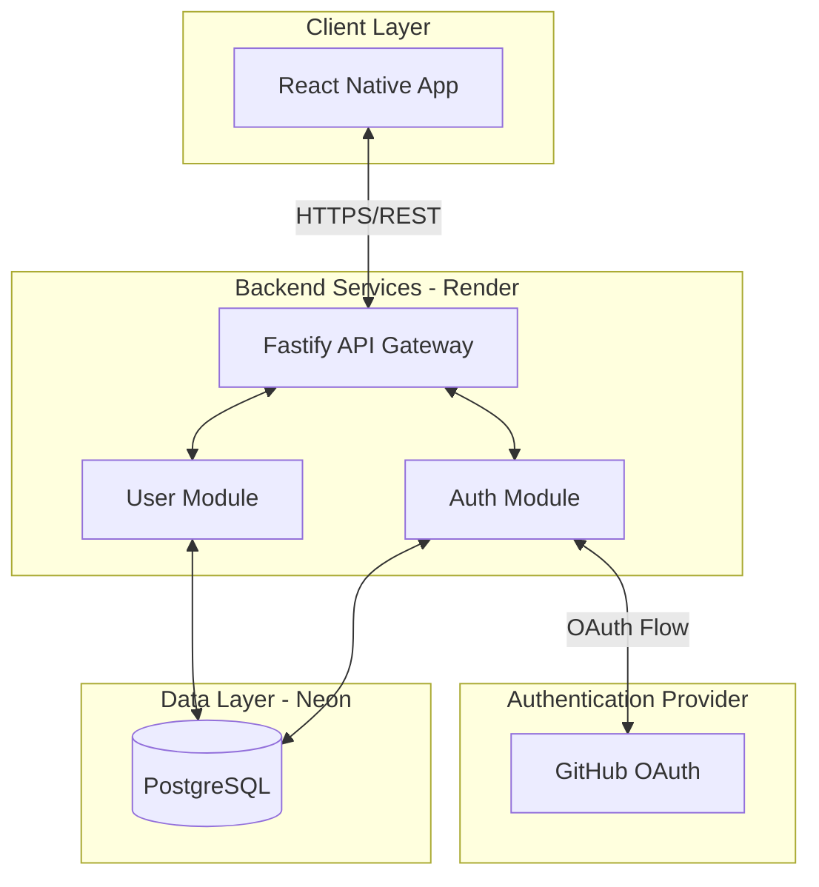
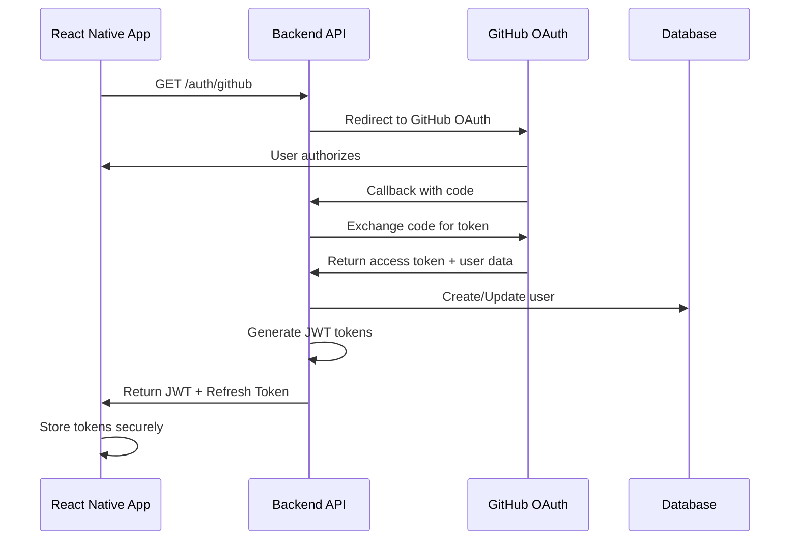
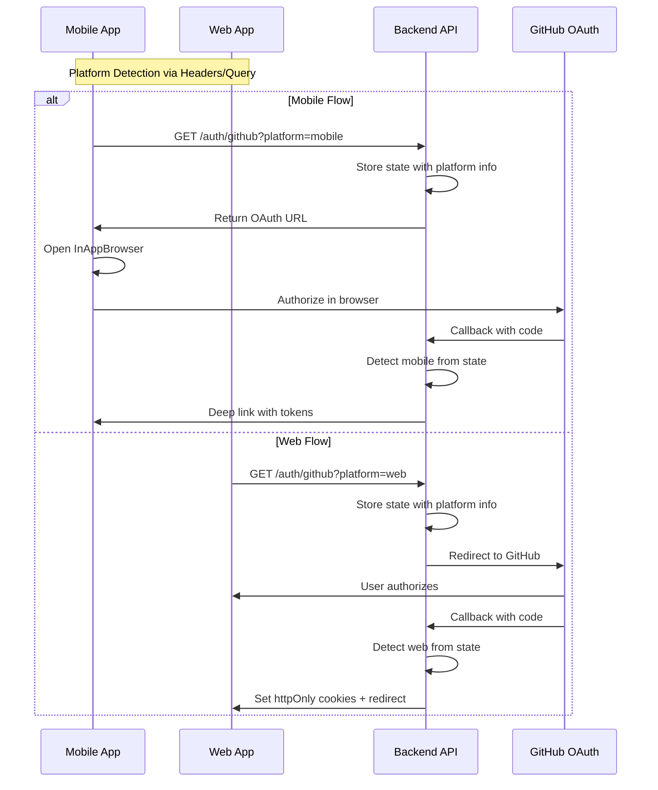

# Technical Implementation Specification: GitHub SSO Authentication

## 1. Executive Summary

This specification outlines the implementation of GitHub Single Sign-On (SSO) authentication for the Breadthwise platform. The solution introduces a modular monolith backend architecture using Fastify, containerized with Docker, deployed on Render, and backed by Neon Postgres serverless database.

## 2. Architecture Overview

### 2.1 High-Level Architecture



### 2.2 Technology Stack

- **Backend Framework**: Fastify 4.x with TypeScript
- **Database**: Neon Postgres (Serverless)
- **ORM**: Drizzle ORM (lightweight, TypeScript-first)
- **Authentication**: Passport.js with GitHub OAuth 2.0
- **Container**: Docker with multi-stage builds
- **Deployment**: Render (Backend), Neon/Vercel (Database)
- **Session Management**: JWT with refresh tokens
- **Validation**: Zod for schema validation

## 3. Project Structure

```
backend/
├── src/
│   ├── modules/
│   │   ├── auth/
│   │   │   ├── auth.controller.ts
│   │   │   ├── auth.service.ts
│   │   │   ├── auth.routes.ts
│   │   │   ├── auth.schemas.ts
│   │   │   ├── strategies/
│   │   │   │   └── github.strategy.ts
│   │   │   └── guards/
│   │   │       └── jwt.guard.ts
│   │   ├── user/
│   │   │   ├── user.controller.ts
│   │   │   ├── user.service.ts
│   │   │   ├── user.routes.ts
│   │   │   ├── user.schemas.ts
│   │   │   └── user.repository.ts
│   │   └── shared/
│   │       ├── database/
│   │       │   ├── client.ts
│   │       │   ├── schema.ts
│   │       │   └── migrations/
│   │       ├── config/
│   │       │   ├── env.ts
│   │       │   └── constants.ts
│   │       ├── middleware/
│   │       │   ├── error-handler.ts
│   │       │   ├── rate-limiter.ts
│   │       │   └── request-logger.ts
│   │       └── utils/
│   │           ├── jwt.utils.ts
│   │           └── crypto.utils.ts
│   ├── app.ts
│   └── server.ts
├── tests/
│   ├── unit/
│   ├── integration/
│   └── e2e/
├── docker/
│   ├── Dockerfile
│   └── docker-compose.yml
├── scripts/
│   ├── migrate.ts
│   └── seed.ts
├── .env.example
├── .gitignore
├── package.json
├── tsconfig.json
├── drizzle.config.ts
└── README.md
```

## 4. Database Schema

### 4.1 Core Tables (Minimal & Lean)

```sql
-- Users table (minimal fields only)
CREATE TABLE users (
    id UUID PRIMARY KEY DEFAULT gen_random_uuid(),
    github_id VARCHAR(255) UNIQUE NOT NULL,
    email VARCHAR(255) UNIQUE,
    username VARCHAR(255) UNIQUE NOT NULL,
    display_name VARCHAR(255),
    avatar_url TEXT,
    created_at TIMESTAMP DEFAULT CURRENT_TIMESTAMP,
    updated_at TIMESTAMP DEFAULT CURRENT_TIMESTAMP
);

-- Refresh tokens for JWT authentication
CREATE TABLE refresh_tokens (
    id UUID PRIMARY KEY DEFAULT gen_random_uuid(),
    user_id UUID NOT NULL REFERENCES users(id) ON DELETE CASCADE,
    token_hash VARCHAR(255) UNIQUE NOT NULL,
    expires_at TIMESTAMP NOT NULL,
    created_at TIMESTAMP DEFAULT CURRENT_TIMESTAMP,
    revoked_at TIMESTAMP
);

-- Indexes for performance
CREATE INDEX idx_users_github_id ON users(github_id);
CREATE INDEX idx_users_email ON users(email);
CREATE INDEX idx_refresh_tokens_user_id ON refresh_tokens(user_id);
CREATE INDEX idx_refresh_tokens_token_hash ON refresh_tokens(token_hash);
```

### 4.2 Drizzle ORM Schema Definition

```typescript
// src/modules/shared/database/schema.ts
import { pgTable, uuid, varchar, timestamp, text } from 'drizzle-orm/pg-core';

export const users = pgTable('users', {
  id: uuid('id').defaultRandom().primaryKey(),
  githubId: varchar('github_id', { length: 255 }).unique().notNull(),
  email: varchar('email', { length: 255 }).unique(),
  username: varchar('username', { length: 255 }).unique().notNull(),
  displayName: varchar('display_name', { length: 255 }),
  avatarUrl: text('avatar_url'),
  createdAt: timestamp('created_at').defaultNow(),
  updatedAt: timestamp('updated_at').defaultNow()
});

export const refreshTokens = pgTable('refresh_tokens', {
  id: uuid('id').defaultRandom().primaryKey(),
  userId: uuid('user_id').notNull().references(() => users.id, { onDelete: 'cascade' }),
  tokenHash: varchar('token_hash', { length: 255 }).unique().notNull(),
  expiresAt: timestamp('expires_at').notNull(),
  createdAt: timestamp('created_at').defaultNow(),
  revokedAt: timestamp('revoked_at')
});
```

## 5. Authentication Flow

### 5.1 GitHub OAuth 2.0 Flow



### 5.2 JWT Token Strategy (Multi-Platform)

```typescript
// Token payload structure
interface JWTPayload {
  sub: string;          // user.id
  githubId: string;
  username: string;
  email?: string;
  iat: number;
  exp: number;
  type: 'access' | 'refresh';
  platform?: 'web' | 'mobile';  // Track token origin
}

// Token expiry
const TOKEN_EXPIRY = {
  ACCESS: '15m',
  REFRESH: '7d',
  REMEMBER_ME_REFRESH: '30d'
};

// Platform-specific token delivery
interface TokenDeliveryStrategy {
  web: {
    method: 'cookie' | 'body';  // httpOnly cookies for web
    sameSite: 'lax';
    secure: true;
  };
  mobile: {
    method: 'body';  // JSON response for mobile
  };
}
```

### 5.3 Platform-Specific OAuth Flow



## 6. API Endpoints

### 6.1 Authentication Endpoints (Multi-Platform)

```yaml
Authentication:
  - GET /auth/github
    Description: Initiates GitHub OAuth flow
    Query: 
      - platform: 'web' | 'mobile' (required)
      - redirect_uri?: string (for mobile deep linking)
    Response: 
      Web: 302 Redirect to GitHub
      Mobile: 200 { authUrl: string, state: string }

  - GET /auth/github/callback
    Description: GitHub OAuth callback
    Query: code, state
    Response: 
      Web: 
        302: Redirect to client with httpOnly cookies set
        Cookies: access_token, refresh_token (httpOnly, secure, sameSite)
      Mobile:
        200: { accessToken, refreshToken, user }
        302: Redirect to deep link with tokens in URL params

  - POST /auth/refresh
    Description: Refresh access token
    Body: { refreshToken? } (mobile only)
    Cookies: refresh_token (web)
    Response:
      Web: 200 with new cookies set
      Mobile: 200 { accessToken, refreshToken }

  - POST /auth/logout
    Description: Logout user
    Headers: Authorization Bearer {token} (mobile)
    Cookies: access_token (web)
    Response: 
      200: { message: "Logged out successfully" }
      Web: Also clears httpOnly cookies

  - POST /auth/revoke-all
    Description: Revoke all user tokens
    Headers: Authorization Bearer {token} (mobile)
    Cookies: access_token (web)
    Response:
      200: { message: "All tokens revoked" }

  - GET /auth/session
    Description: Validate current session (web primary)
    Cookies: access_token
    Response:
      200: { user, expiresAt }
      401: { error: "No valid session" }
```

### 6.2 User Management Endpoints

```yaml
User Management:
  - GET /users/me
    Description: Get current authenticated user
    Headers: Authorization Bearer {token}
    Response:
      200: {
        user: {
          id: string,
          githubId: string,
          username: string,
          displayName: string,
          email: string,
          avatarUrl: string,
          createdAt: string,
          updatedAt: string
        }
      }
      401: { error: "Unauthorized" }

  - PATCH /users/me
    Description: Update user information
    Headers: Authorization Bearer {token}
    Body: {
      displayName?: string,
      avatarUrl?: string
    }
    Response:
      200: { user: User }
      400: { error: "Invalid input" }
      401: { error: "Unauthorized" }
```

## 7. Backend Implementation Details

### 7.1 Fastify App Configuration

```typescript
// src/app.ts
import Fastify from 'fastify';
import cors from '@fastify/cors';
import helmet from '@fastify/helmet';
import rateLimit from '@fastify/rate-limit';
import { TypeBoxTypeProvider } from '@fastify/type-provider-typebox';
import { authModule } from './modules/auth';
import { userModule } from './modules/user';
import { errorHandler } from './modules/shared/middleware/error-handler';
import { requestLogger } from './modules/shared/middleware/request-logger';

export async function buildApp() {
  const app = Fastify({
    logger: true,
    trustProxy: true,
  }).withTypeProvider<TypeBoxTypeProvider>();

  // Global middleware
  await app.register(helmet, {
    contentSecurityPolicy: {
      directives: {
        defaultSrc: ["'self'"],
        styleSrc: ["'self'", "'unsafe-inline'"],
      },
    },
  });

  await app.register(cors, {
    origin: process.env.CLIENT_URL,
    credentials: true,
  });

  await app.register(rateLimit, {
    max: 100,
    timeWindow: '15 minutes',
  });

  // Custom middleware
  app.addHook('onRequest', requestLogger);
  app.setErrorHandler(errorHandler);

  // Register modules
  await app.register(authModule, { prefix: '/auth' });
  await app.register(userModule, { prefix: '/users' });

  // Health check
  app.get('/health', async () => ({ status: 'healthy' }));

  return app;
}
```

### 7.2 Environment Configuration

```typescript
// src/modules/shared/config/env.ts
import { z } from 'zod';

const envSchema = z.object({
  NODE_ENV: z.enum(['development', 'production', 'test']),
  PORT: z.string().transform(Number).default('3000'),
  
  // Database
  DATABASE_URL: z.string(),
  
  // GitHub OAuth
  GITHUB_CLIENT_ID: z.string(),
  GITHUB_CLIENT_SECRET: z.string(),
  GITHUB_CALLBACK_URL: z.string(),
  
  // JWT
  JWT_ACCESS_SECRET: z.string().min(32),
  JWT_REFRESH_SECRET: z.string().min(32),
  
  // Client URLs (separate for web and mobile)
  WEB_CLIENT_URL: z.string().url(),
  MOBILE_DEEP_LINK_SCHEME: z.string().default('myapp://'),
  
  // Cookie settings
  COOKIE_DOMAIN: z.string().optional(),
  SECURE_COOKIES: z.boolean().default(true),
  
  // Security
  ALLOWED_ORIGINS: z.string().transform(s => s.split(',')),
  ENABLE_FINGERPRINTING: z.boolean().default(true),
});

export const env = envSchema.parse(process.env);
```

## 8. Security Considerations (Multi-Platform)

### Benefits of This Approach

1. **Web Benefits**
   - HttpOnly cookies prevent XSS token theft
   - Automatic token inclusion (no manual header management)
   - Built-in CSRF protection with sameSite cookies
   - Server-side session validation

2. **Mobile Benefits**
   - Standard Bearer token approach
   - Easy integration with existing mobile auth libraries
   - Works with deep linking for OAuth flows
   - No cookie complications in native apps

3. **Shared Benefits**
   - Single backend serving both platforms
   - Unified user management
   - Consistent API structure
   - Platform-specific optimizations


### 8.1 Platform-Specific Security Measures

#### Web Security
1. **HttpOnly Cookies**
   - Access tokens stored in httpOnly, secure, sameSite cookies
   - Prevents XSS attacks from accessing tokens
   - CSRF protection via sameSite='lax' and origin validation

2. **Content Security Policy**
   - Strict CSP headers to prevent XSS
   - Disallow inline scripts
   - Whitelist trusted domains only

3. **Session Management**
   - Short-lived access tokens (15 minutes)
   - Refresh tokens limited to /auth/refresh path
   - Automatic token rotation on refresh

#### Mobile Security
1. **Secure Token Storage**
   - Tokens in AsyncStorage (iOS: Keychain, Android: SharedPreferences)
   - Consider react-native-keychain for enhanced security
   - Biometric authentication for sensitive operations

2. **Certificate Pinning**
   - Pin backend SSL certificates
   - Prevent MITM attacks
   - Use react-native-ssl-pinning

3. **Deep Link Security**
   - Validate redirect_uri against whitelist
   - Use app-specific schemes (myapp://)
   - Implement state parameter validation

### 8.2 Common Security Measures

1. **Token Security**
   - JWT tokens signed with RS256
   - Different secrets for access/refresh tokens
   - Token fingerprinting (device ID, user agent)
   - Blacklist mechanism for revoked tokens

2. **Rate Limiting**
   - Global: 100 requests/15 minutes
   - Auth endpoints: 5 attempts/15 minutes
   - Per-platform rate limits

3. **Input Validation**
   - Zod schemas for all inputs
   - Platform header validation
   - SQL injection prevention via parameterized queries

4. **Audit Logging**
   ```typescript
   interface AuthAuditLog {
     userId: string;
     action: 'login' | 'logout' | 'refresh' | 'revoke';
     platform: 'web' | 'mobile';
     ipAddress: string;
     userAgent: string;
     timestamp: Date;
     success: boolean;
   }
   ```

### 8.3 Token Security Implementation

```typescript
// src/modules/auth/services/token.service.ts
import crypto from 'crypto';

export class TokenService {
  // Generate token fingerprint for additional security
  generateFingerprint(req: FastifyRequest): string {
    const components = [
      req.headers['user-agent'],
      req.ip,
      req.headers['x-platform'],
      // Add device ID for mobile
      req.headers['x-device-id'],
    ].filter(Boolean);
    
    return crypto
      .createHash('sha256')
      .update(components.join('|'))
      .digest('hex');
  }

  // Validate token with fingerprint
  async validateToken(token: string, req: FastifyRequest): Promise<boolean> {
    const payload = await this.verifyJWT(token);
    
    if (payload.fingerprint) {
      const currentFingerprint = this.generateFingerprint(req);
      if (payload.fingerprint !== currentFingerprint) {
        throw new Error('Token fingerprint mismatch');
      }
    }
    
    // Check if token is blacklisted
    if (await this.isBlacklisted(token)) {
      throw new Error('Token has been revoked');
    }
    
    return true;
  }

  // Platform-specific token generation
  async generateTokens(userId: string, platform: 'web' | 'mobile', req: FastifyRequest) {
    const fingerprint = this.generateFingerprint(req);
    
    const accessToken = await this.signJWT({
      sub: userId,
      platform,
      fingerprint,
      type: 'access',
    }, TOKEN_EXPIRY.ACCESS);
    
    const refreshToken = await this.signJWT({
      sub: userId,
      platform,
      fingerprint,
      type: 'refresh',
    }, platform === 'web' ? TOKEN_EXPIRY.REFRESH : TOKEN_EXPIRY.REMEMBER_ME_REFRESH);
    
    return { accessToken, refreshToken };
  }
}
```

## 9. Docker Configuration

### 9.1 Dockerfile

```dockerfile
# Multi-stage build
FROM node:20-alpine AS builder

WORKDIR /app

# Copy package files
COPY package*.json ./
COPY pnpm-lock.yaml ./

# Install dependencies
RUN npm install -g pnpm
RUN pnpm install --frozen-lockfile

# Copy source code
COPY . .

# Build application
RUN pnpm build

# Production stage
FROM node:20-alpine AS production

WORKDIR /app

# Install pnpm
RUN npm install -g pnpm

# Copy package files and install production deps
COPY package*.json ./
COPY pnpm-lock.yaml ./
RUN pnpm install --prod --frozen-lockfile

# Copy built application
COPY --from=builder /app/dist ./dist

# Create non-root user
RUN addgroup -g 1001 -S nodejs
RUN adduser -S nodejs -u 1001
USER nodejs

# Health check
HEALTHCHECK --interval=30s --timeout=3s --start-period=5s --retries=3 \
  CMD node -e "require('http').get('http://localhost:3000/health', (r) => r.statusCode === 200 ? process.exit(0) : process.exit(1))"

EXPOSE 3000

CMD ["node", "dist/server.js"]
```

## 10. Deployment Configuration

### 10.1 Render Configuration

```yaml
# render.yaml
services:
  - type: web
    name: breadthwise-api
    runtime: docker
    dockerfilePath: ./backend/docker/Dockerfile
    dockerContext: ./backend
    envVars:
      - key: NODE_ENV
        value: production
      - key: DATABASE_URL
        fromDatabase:
          name: knowledge-expansion-db
          property: connectionString
      - key: GITHUB_CLIENT_ID
        fromSecret: github-client-id
      - key: GITHUB_CLIENT_SECRET
        fromSecret: github-client-secret
      - key: JWT_ACCESS_SECRET
        generateValue: true
      - key: JWT_REFRESH_SECRET
        generateValue: true
    healthCheckPath: /health
    autoDeploy: true
```

### 10.2 Database Migration Strategy

```typescript
// scripts/migrate.ts
import { migrate } from 'drizzle-orm/neon-http/migrator';
import { db } from '../src/modules/shared/database/client';

async function runMigrations() {
  console.log('Running migrations...');
  await migrate(db, {
    migrationsFolder: './src/modules/shared/database/migrations',
  });
  console.log('Migrations completed');
  process.exit(0);
}

runMigrations().catch((err) => {
  console.error('Migration failed', err);
  process.exit(1);
});
```

## 11. React Native & Web Integration

### 11.1 Mobile Authentication Service (React Native)

```typescript
// React Native - services/auth.service.ts
import AsyncStorage from '@react-native-async-storage/async-storage';
import { InAppBrowser } from 'react-native-inappbrowser-reborn';

class MobileAuthService {
  private readonly API_URL = process.env.API_URL;
  
  async loginWithGitHub(): Promise<AuthTokens> {
    const authUrl = `${this.API_URL}/auth/github?platform=mobile&redirect_uri=myapp://auth/callback`;
    
    if (await InAppBrowser.isAvailable()) {
      const result = await InAppBrowser.openAuth(authUrl, 'myapp://auth/callback', {
        ephemeralWebSession: false,
        showTitle: false,
        enableUrlBarHiding: true,
        enableDefaultShare: false,
      });
      
      if (result.type === 'success' && result.url) {
        const tokens = this.extractTokensFromUrl(result.url);
        await this.storeTokens(tokens);
        return tokens;
      }
    }
    throw new Error('Authentication failed');
  }

  async refreshToken(): Promise<string> {
    const refreshToken = await AsyncStorage.getItem('refreshToken');
    const response = await fetch(`${this.API_URL}/auth/refresh`, {
      method: 'POST',
      headers: { 'Content-Type': 'application/json' },
      body: JSON.stringify({ refreshToken }),
    });
    
    if (!response.ok) throw new Error('Token refresh failed');
    
    const { accessToken, refreshToken: newRefreshToken } = await response.json();
    await this.storeTokens({ accessToken, refreshToken: newRefreshToken });
    return accessToken;
  }

  async makeAuthenticatedRequest(url: string, options: RequestInit = {}): Promise<Response> {
    const accessToken = await AsyncStorage.getItem('accessToken');
    
    return fetch(url, {
      ...options,
      headers: {
        ...options.headers,
        'Authorization': `Bearer ${accessToken}`,
        'X-Platform': 'mobile',
      },
    });
  }

  private async storeTokens(tokens: AuthTokens): Promise<void> {
    await AsyncStorage.multiSet([
      ['accessToken', tokens.accessToken],
      ['refreshToken', tokens.refreshToken],
    ]);
  }
}
```

### 11.2 Web Authentication Service (React/Next.js)

```typescript
// Web - services/auth.service.ts
class WebAuthService {
  private readonly API_URL = process.env.NEXT_PUBLIC_API_URL;
  
  async loginWithGitHub(): Promise<void> {
    // Simply redirect to backend OAuth endpoint
    window.location.href = `${this.API_URL}/auth/github?platform=web`;
  }

  async checkSession(): Promise<User | null> {
    // Cookies are automatically sent
    const response = await fetch(`${this.API_URL}/auth/session`, {
      credentials: 'include',
    });
    
    if (response.ok) {
      const { user } = await response.json();
      return user;
    }
    return null;
  }

  async refreshToken(): Promise<boolean> {
    // Cookies are automatically sent
    const response = await fetch(`${this.API_URL}/auth/refresh`, {
      method: 'POST',
      credentials: 'include',
    });
    
    return response.ok;
  }

  async logout(): Promise<void> {
    await fetch(`${this.API_URL}/auth/logout`, {
      method: 'POST',
      credentials: 'include',
    });
  }

  async makeAuthenticatedRequest(url: string, options: RequestInit = {}): Promise<Response> {
    // Cookies are automatically sent with credentials: 'include'
    return fetch(url, {
      ...options,
      credentials: 'include',
      headers: {
        ...options.headers,
        'X-Platform': 'web',
      },
    });
  }
}
```

### 11.3 Unified API Client with Platform Detection

```typescript
// Shared - api/client.ts
export class UnifiedApiClient {
  private authService: MobileAuthService | WebAuthService;
  private platform: 'mobile' | 'web';
  
  constructor() {
    this.platform = this.detectPlatform();
    this.authService = this.platform === 'mobile' 
      ? new MobileAuthService() 
      : new WebAuthService();
  }

  private detectPlatform(): 'mobile' | 'web' {
    // React Native detection
    if (typeof navigator !== 'undefined' && navigator.product === 'ReactNative') {
      return 'mobile';
    }
    // Expo detection
    if (typeof window !== 'undefined' && window.expo) {
      return 'mobile';
    }
    return 'web';
  }

  async request(endpoint: string, options: RequestInit = {}): Promise<any> {
    const url = `${process.env.API_URL}${endpoint}`;
    
    let response = await this.authService.makeAuthenticatedRequest(url, options);
    
    // Handle token refresh
    if (response.status === 401) {
      const refreshed = await this.authService.refreshToken();
      if (refreshed) {
        // Retry request with new token
        response = await this.authService.makeAuthenticatedRequest(url, options);
      } else {
        // Redirect to login
        this.handleAuthFailure();
      }
    }
    
    if (!response.ok) {
      throw new Error(`API error: ${response.status}`);
    }
    
    return response.json();
  }

  private handleAuthFailure(): void {
    if (this.platform === 'web') {
      window.location.href = '/login';
    } else {
      // Emit event for mobile app to handle
      // EventEmitter.emit('auth:failure');
    }
  }
}
```

## 12. Monitoring

### 12.1 Logging Strategy

```typescript
// Structured logging with Pino
import pino from 'pino';

export const logger = pino({
  level: process.env.LOG_LEVEL || 'info',
  transport: {
    target: 'pino-pretty',
    options: {
      colorize: true,
    },
  },
  serializers: {
    req: (req) => ({
      method: req.method,
      url: req.url,
      userId: req.user?.id,
    }),
    res: (res) => ({
      statusCode: res.statusCode,
    }),
  },
});
```

## 13. Implementation Plan

### Phase 1: Backend Setup (Week 1)
- [ ] Initialize backend project structure
- [ ] Set up Docker configuration
- [ ] Configure Neon database
- [ ] Implement database schemas (users, refresh_tokens)

### Phase 2: Authentication (Week 2)
- [ ] Implement GitHub OAuth integration
- [ ] JWT token generation and validation
- [ ] Refresh token management
- [ ] Auth middleware and guards
- [ ] Platform detection (web/mobile)

### Phase 3: User Management (Week 3)
- [ ] User CRUD operations
- [ ] User update endpoint
- [ ] Input validation with Zod
- [ ] Error handling

### Phase 4: Client Integration (Week 4)
- [ ] Update React Native auth flow
- [ ] Update web auth flow
- [ ] Test multi-platform authentication
- [ ] Testing and bug fixes

### Phase 5: Deployment (Week 5)
- [ ] Deploy to Render
- [ ] Configure environment variables
- [ ] Set up monitoring and logging
- [ ] Performance testing
- [ ] Production readiness


