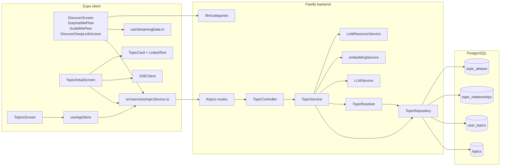
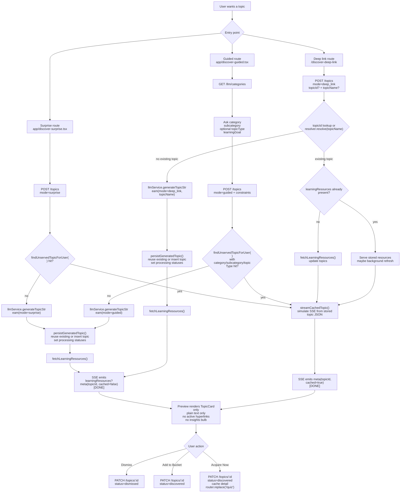
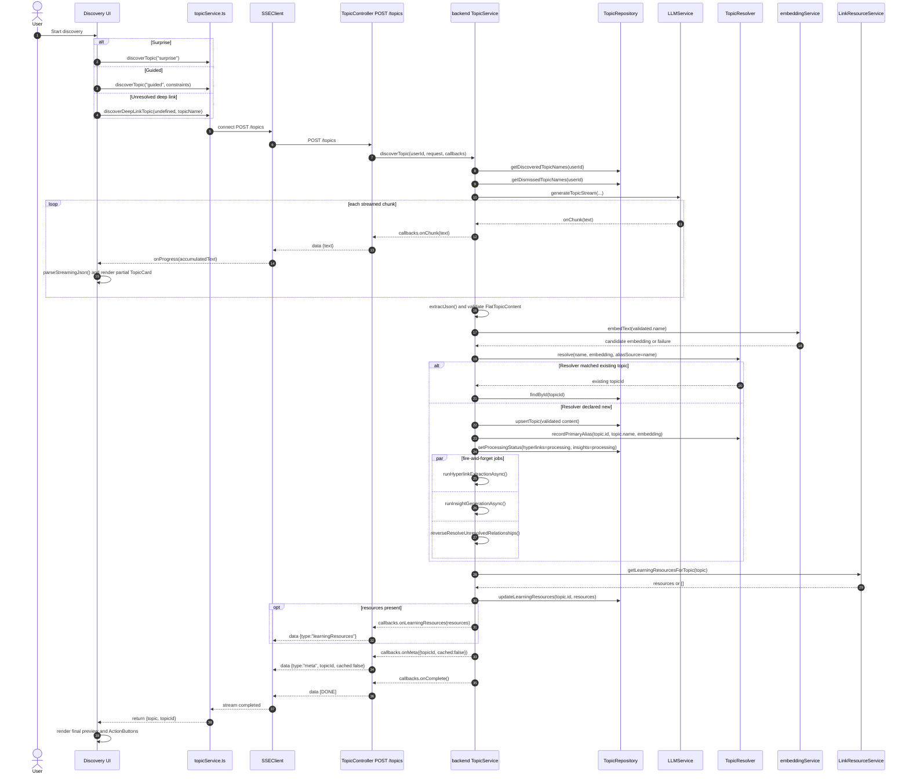
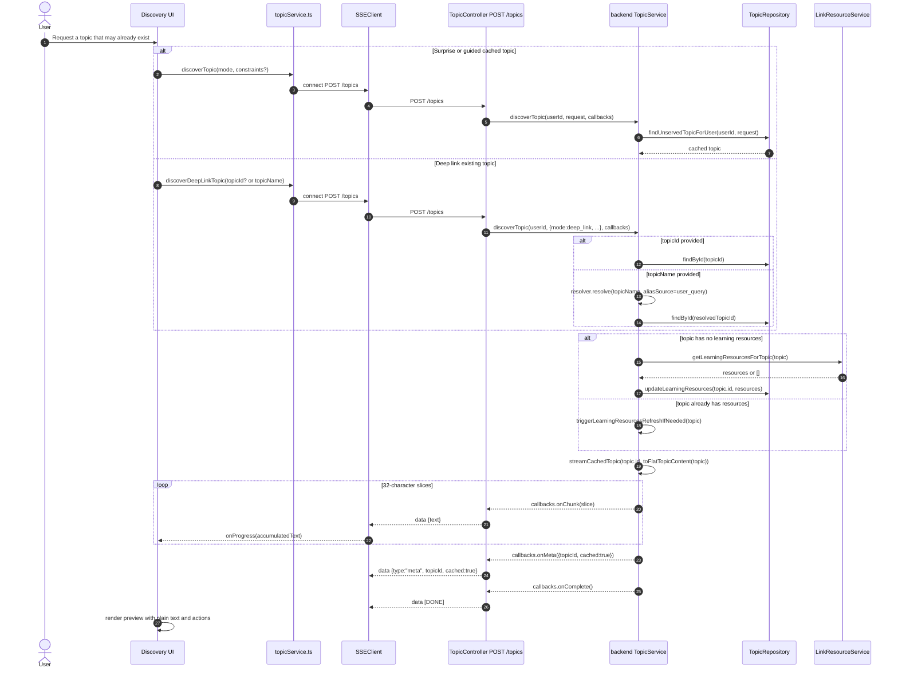
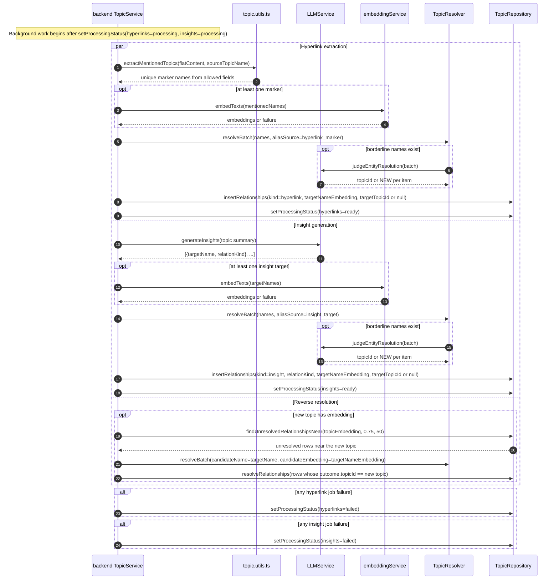
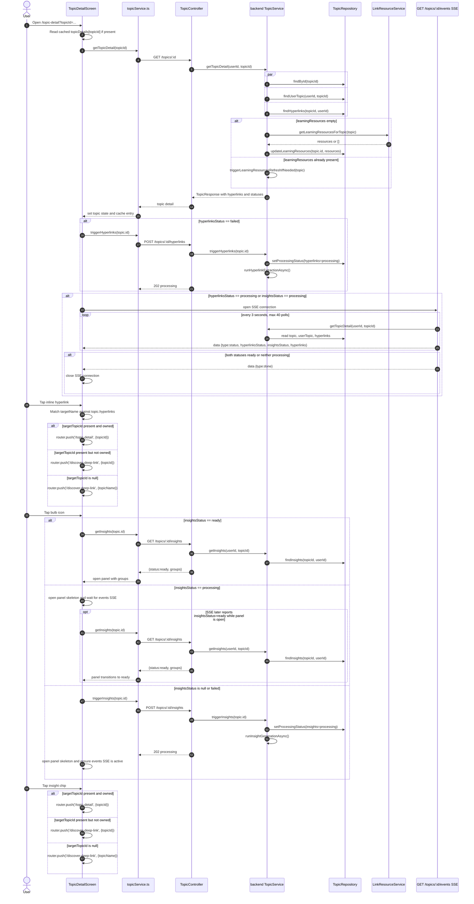
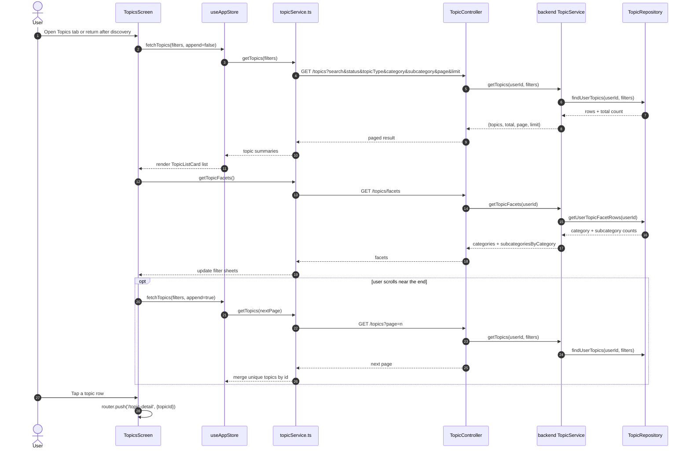

# Topics Feature Architecture (Code-Derived)

This document is derived from runtime code only. It covers topic discovery, persistence, relationship generation, relationship resolution, and retrieval across the Expo client and the Fastify backend.

Validated against code on 2026-05-01.

## Code Anchors

Frontend

- [src/services/topicService.ts](../src/services/topicService.ts)
- [src/components/discover/SurpriseMeFlow.tsx](../src/components/discover/SurpriseMeFlow.tsx)
- [src/components/discover/GuideMeFlow.tsx](../src/components/discover/GuideMeFlow.tsx)
- [src/components/discover/DiscoverDeepLinkScreen.tsx](../src/components/discover/DiscoverDeepLinkScreen.tsx)
- [src/components/discover/TopicDetailScreen.tsx](../src/components/discover/TopicDetailScreen.tsx)
- [src/components/discover/TopicCard.tsx](../src/components/discover/TopicCard.tsx)
- [src/components/common/LinkedText.tsx](../src/components/common/LinkedText.tsx)
- [src/store/useAppStore.ts](../src/store/useAppStore.ts)
- [src/services/sseService.ts](../src/services/sseService.ts)

Backend

- [backend/src/modules/topic/topic.routes.ts](../backend/src/modules/topic/topic.routes.ts)
- [backend/src/modules/topic/topic.controller.ts](../backend/src/modules/topic/topic.controller.ts)
- [backend/src/modules/topic/topic.service.ts](../backend/src/modules/topic/topic.service.ts)
- [backend/src/modules/topic/topic.repository.ts](../backend/src/modules/topic/topic.repository.ts)
- [backend/src/modules/topic/topic.resolver.ts](../backend/src/modules/topic/topic.resolver.ts)
- [backend/src/modules/topic/topic.utils.ts](../backend/src/modules/topic/topic.utils.ts)
- [backend/src/modules/topic/link-resource.service.ts](../backend/src/modules/topic/link-resource.service.ts)
- [backend/src/modules/llm/llm.service.ts](../backend/src/modules/llm/llm.service.ts)
- [backend/src/modules/llm/prompts.ts](../backend/src/modules/llm/prompts.ts)
- [backend/src/modules/shared/database/schema.ts](../backend/src/modules/shared/database/schema.ts)

## Runtime Topology

## Topic Discovery Flow

This is the runtime discovery flow for `surprise`, `guided`, and `deep_link`. It reflects how the app decides between cached topics, existing topics, and LLM generation.

Discovery facts that matter:

- Guided discovery loads its taxonomy from `GET /llm/categories`, then conditionally skips the topic-type question when the selected subcategory exposes exactly one topic type.
- Guided cache reuse filters by `category`, `subcategory`, and `topicType`. `learningGoal` is forwarded to generation but does not affect cached-topic selection.
- Surprise, guided, and deep-link previews do not create `user_topics` until the user acts on the preview via `PATCH /topics/:id`.
- Deep-link discovery still differs in how it resolves the preview topic, but ownership is deferred the same way as the other discovery modes.
- Cached discovery still streams over SSE because `streamCachedTopic()` slices stored JSON into 32-character chunks with a 12 ms delay.

## Relationship Resolution Algorithm

`TopicResolver` is the shared dedupe and name-resolution engine used by deep-link lookup, hyperlink extraction, insight generation, and post-create reverse resolution.

```mermaid
---
config:
  htmlLabels: false
  markdownAutoWrap: true
---
flowchart TD
    subgraph Resolve["TopicResolver.resolve / resolveBatch"]
        Input["`candidateName
        candidateEmbedding
        aliasSource
        contextHint`"] --> Exact{"findAliasExact(trimmedName)?"}
        Exact -->|hit| ExactReturn["`Match existing topic
        confidence=exact`"]
        Exact -->|miss| HasEmbedding{"Embedding available?"}
        HasEmbedding -->|no| NewNoEmbedding["`Return NEW
        tier0_miss_no_embedding`"]
        HasEmbedding -->|yes| Neighbors["`findAliasNeighbors()
        candidateEmbedding, k=5`"]
        Neighbors --> AnyNeighbors{"Any neighbors?"}
        AnyNeighbors -->|no| NewNoNeighbors["`Return NEW
        tier3_no_neighbors`"]
        AnyNeighbors -->|yes| HighGate{"`top.score >= 0.92
        topic-consistent
        margin guard passes`"}
        HighGate -->|yes| RecordHighAlias["`upsertAlias(candidateName,
        matchedTopicId,
        aliasSource)`"]
        RecordHighAlias --> HighReturn["`Match existing topic
        confidence=high_vector`"]
        HighGate -->|no| LowGate{"top.score < 0.75?"}
        LowGate -->|yes| NewLow["`Return NEW
        below low threshold`"]
        LowGate -->|no| JudgePrep["`Deduplicate candidate topics
        load aliases for each topic`"]
        JudgePrep --> Judge["LLM judgeEntityResolution()"]
        Judge --> JudgeMatch{"Judge returned offered topicId?"}
        JudgeMatch -->|yes| RecordJudgeAlias["`upsertAlias(candidateName,
        matchedTopicId,
        aliasSource)`"]
        RecordJudgeAlias --> JudgeReturn["`Match existing topic
        confidence=judged`"]
        JudgeMatch -->|no or judge error| NewJudge["`Return NEW
        tier2_judged_new`"]
    end

    subgraph Materialize["How hyperlinks and insights use the resolver"]
        HyperSource["`Hyperlink extraction
        extractMentionedTopics()
        from [[markers]]`"] --> BatchHyper["resolveBatch(names, aliasSource=hyperlink_marker)"]
        InsightSource["`Insight generation
        LLM returns targetName + relationKind`"] --> BatchInsight["resolveBatch(names, aliasSource=insight_target)"]
        BatchHyper --> InsertHyper["`insert topic_relationships rows
        kind=hyperlink
        resolved targetTopicId or null`"]
        BatchInsight --> InsertInsight["`insert topic_relationships rows
        kind=insight
        relationKind set`"]
    end

    subgraph ReverseResolve["After a new topic is created"]
        NewTopic["`persistGeneratedTopic()
        upsertTopic()
        recordPrimaryAlias`"] --> HasTopicEmbedding{"Topic embedding available?"}
        HasTopicEmbedding -->|no| End["Stop"]
        HasTopicEmbedding -->|yes| NearRows["`findUnresolvedRelationshipsNear()
        topicEmbedding, 0.75, 50`"]
        NearRows --> HaveRows{"Any unresolved rows near the new topic?"}
        HaveRows -->|no| End
        HaveRows -->|yes| ReverseInputs["`Build ResolveInput from each unresolved row
        candidateName=targetName
        candidateEmbedding=targetNameEmbedding`"]
        ReverseInputs --> ReverseBatch["resolveBatch(...)"]
        ReverseBatch --> FlipMatches["`resolveRelationships()
        set target_topic_id + resolved_at
        only when outcome.topicId == new topic`"]
    end
```

Resolution facts that matter:

- Every successful match grows the alias graph by inserting the candidate surface form into `topic_aliases`.
- Borderline names do not each trigger their own judge call. `resolveBatch()` combines them into one LLM judgment pass.
- Relationship rows can remain unresolved with `target_topic_id = null` until a later topic creation flips them during reverse resolution.

## Sequence Diagrams

### 1. New Topic Generation

This is the fresh-generation path for surprise, guided, or unresolved deep-link discovery.

### 2. Cached Discovery and Existing Deep Link Retrieval

This is the no-new-LLM path used when surprise/guided can reuse an unowned topic or when deep-link lookup resolves an existing topic.

### 3. Hyperlink and Insight Generation

These jobs are kicked off from `persistGeneratedTopic()` after the topic record exists and both processing flags are written.

### 4. Topic Detail Retrieval, Hyperlink Retrieval, and Insight Retrieval

This is the owned-topic path used after a topic is in `user_topics` and the app navigates to `/topic-detail`.

### 5. Topics List Retrieval

This is the collection retrieval path used by the Topics tab, including pagination and facet loading.

## Data and Status Facts That Matter

| Field                               | Stored on             | Meaning in the running system                                                      |
| ----------------------------------- | --------------------- | ---------------------------------------------------------------------------------- |
| `status`                            | `user_topics`         | Per-user ownership state: `discovered`, `learned`, or `dismissed`                  |
| `discoveryMethod`                   | `user_topics`         | Which UX flow attached the user to the topic: `surprise`, `guided`, or `deep_link` |
| `hyperlinksStatus`                  | `topics`              | Async hyperlink extraction state for the shared topic record                       |
| `insightsStatus`                    | `topics`              | Async insight generation state for the shared topic record                         |
| `targetTopicId`                     | `topic_relationships` | Resolved target topic if known; `null` means the relationship exists by name only  |
| `aliasTextLower` + `aliasEmbedding` | `topic_aliases`       | The durable surface-form lookup index used by the resolver                         |

## Implementation Facts Worth Keeping In Mind

- Discovery previews are always plain text because `TopicCard` only gets `getLinkVariant` and `onTopicPress` from `TopicDetailScreen`. Without those props, `LinkedText` strips `[[markers]]` and renders non-clickable text.
- `GET /topics/:id` requires both a shared `topics` row and a per-user `user_topics` row. Missing either one returns `TOPIC_NOT_FOUND`.
- `GET /topics/:id/events` is not push from the database. The controller polls `getTopicDetail()` every 3 seconds, up to 40 times, and emits SSE frames with the latest statuses and hyperlinks.
- Failed hyperlink extraction is retried automatically by `TopicDetailScreen` on load. Failed insight generation is retried only after user action, either by reopening insights from the bulb icon or by tapping Retry in `InsightsPanel`.
- Learning resources are fetched synchronously when missing during discovery or detail retrieval so the first response can include them. When resources already exist, the backend may refresh them in the background if they are stale and not on cooldown.
- Hyperlink extraction only scans the allowed content fields in `FlatTopicContent`. Insight generation is a separate LLM call that returns `targetName` and `relationKind` pairs.
- Surprise and guided discovery choose from topics that have no `user_topics` row for the current user. Dismissed topics are therefore excluded from future surprise/guided reuse until their `user_topics` row changes.
